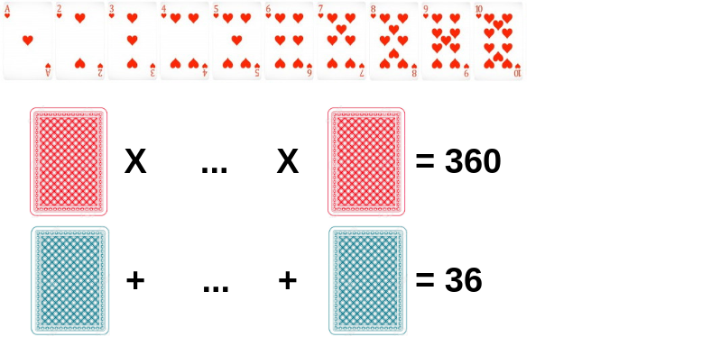
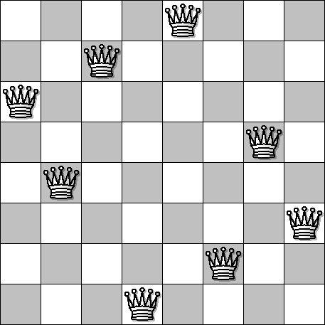

# Algorithmes évolutionnaires

## Définitions

Les algorithmes évolutionnistes ou algorithmes évolutionnaires (evolutionary algorithms en anglais), sont une famille
d'algorithmes dont le principe s'inspire de la théorie de l'évolution pour résoudre des problèmes divers. [...] L'idée
est de faire évoluer un ensemble de solutions à un problème donné, dans l'optique de trouver les meilleurs résultats. Ce
sont des algorithmes dits stochastiques, car ils utilisent itérativement des processus aléatoires.

wikipedia: https://fr.wikipedia.org/wiki/Algorithme_%C3%A9volutionniste

# Jeu de carte

dans un tas de carte allant du 1 au 10, former deux tas pour que la somme du premier est de 36 et le produit du second
fait 360.

[code](./src/cardgame/CardGame.java)

# Le problème des N dames

Placer N dames sur un damier N x N de sorte que les dames ne rentrent jamais en colision.

[code](./src/chessgame/ChessGame.java)

